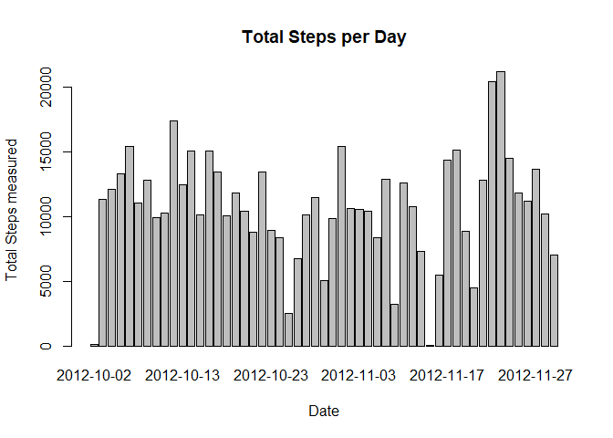
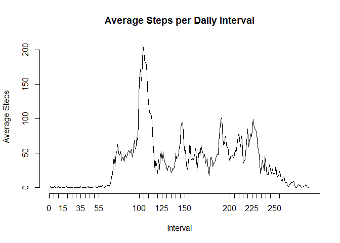
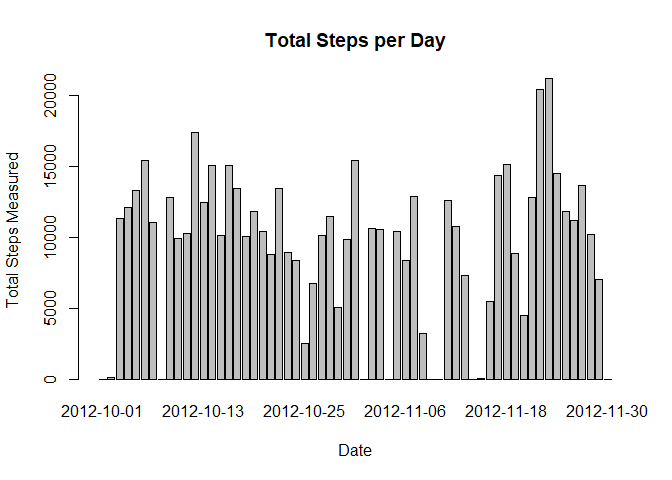
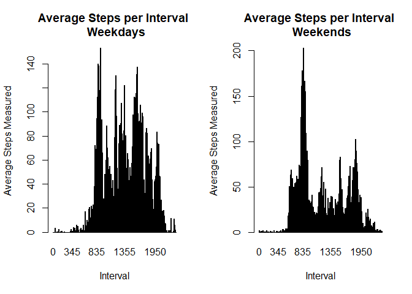

## Loading and preprocessing the data
First we load the required data to perform the analysis:

```r
rawStepDataSet <- read.csv("activity.csv")
filteredStepDataSet <- rawStepDataSet[!is.na(rawStepDataSet$steps),]
```


## What is mean total number of steps taken per day?

In this section we proceed to calculate the total steps taken per day considering only the processed data after discarding the NA samples.


```r
# Obtain the distinct days of the filtered data set
targetDays <- unique(filteredStepDataSet$date)
resultData <- data.frame("Day"=character(),"TotalSteps"=numeric(),stringsAsFactors = FALSE)
colnames(resultData) <- c("Day","Total.Steps")

for (targetDay in targetDays) {
  #Filter the data
  currentDayData <-filteredStepDataSet[filteredStepDataSet$date == targetDay,]
  #Get the current total of emissions on that year
  currentStepsTotal <- sum(currentDayData$steps)
  newRow <- data.frame(targetDay,currentStepsTotal)
  resultData <- rbind(resultData,newRow) 
}
```

```r
barplot(resultData$currentStepsTotal,main = "Total Steps per Day",xlab = "Date",names.arg = unique(resultData$targetDay),ylab = "Total Steps measured")
```

<div class="figure" style="text-align: center">

<p class="caption">Figure 1 - Total Steps per Day considering non-NA data</p>
</div>


```r
totalStepsMean <- mean(resultData$currentStepsTotal)
totalStepsMedian <- median(resultData$currentStepsTotal)
```
Based on this data we observe a mean of 1.0766189\times 10^{4} steps in total per day. Also with a reported median of 10765. 

## What is the average daily activity pattern?

Now, focusing on the patterns per daily interval, we can observe the following behavior as illustrated in the following plot:


```r
# Obtain the distinct days of the filtered data set
targetIntervals <- unique(filteredStepDataSet$interval)
resultData4 <- data.frame("Interval"=numeric(),"Average.Steps"=numeric(),stringsAsFactors = FALSE)

for (targetInterval in targetIntervals) {
  #Filter the data
  currentInterval <-filteredStepDataSet[filteredStepDataSet$interval == targetInterval,]
  #Get the current total of emissions on that year
  currentStepsAverage <- mean(currentInterval$steps)
  newRow <- data.frame(targetInterval,currentStepsAverage)
  resultData4 <- rbind(resultData4,newRow) 
}
colnames(resultData4) <- c("Interval","Average.Steps")
```

```r
plot.ts(resultData4$Average.Steps,main="Average Steps per Daily Interval",ylab="Average Steps",xlab="Interval",axes = F)
axis(2)
axis(1,at=resultData4$Interval,labels = resultData4$Interval)
```

<div class="figure" style="text-align: center">

<p class="caption">Figure 2 - Average Steps per Daily Interval</p>
</div>


```r
finalResultIntervfal = resultData4[max(resultData4$Average.Steps) == resultData4$Average.Steps,]
```

From analysis illustrated above it can be observed that the most active daily interval is 835 with 206.1698113 steps in average.

## Imputing missing values

It is understood that there is missing data on the input file. So lets quantify it given the following code:

```r
missingSamples <- sum(is.na(rawStepDataSet$steps))
```

As a result we obtain that there are 2304 missing steps samples.

One strategy to replace the missing data across the data set. Particularly on the 'steps' column would be to replace the 'NA' values with zeros, since no safe assumptions can be made in order to interpolate across the time intervals.

Given that strategy, the code to implement such data filling is disclosed as it follows:

```r
filledStepDataSet <- read.csv("activity.csv")

#Fill the steps column with 0s on missng values
filledStepDataSet[is.na(filledStepDataSet)]<-0
```
Now considering the new data set we recalculate the same histogram as illustrted on Fig. 1:


```r
# Obtain the distinct days of the filtered data set
targetDays <- unique(filledStepDataSet$date)
resultData5 <- data.frame("Day"=character(),"TotalSteps"=numeric(),stringsAsFactors = FALSE)
colnames(resultData5) <- c("Day","Total.Steps")

for (targetDay in targetDays) {
  #Filter the data
  currentDayData <-filledStepDataSet[filledStepDataSet$date == targetDay,]
  #Get the current total of emissions on that year
  currentStepsTotal <- sum(currentDayData$steps)
  newRow <- data.frame(targetDay,currentStepsTotal)
  resultData5 <- rbind(resultData5,newRow) 
}

barplot(resultData5$currentStepsTotal,main = "Total Steps per Day",xlab = "Date",names.arg = unique(resultData5$targetDay),ylab = "Total Steps Measured")
```

<div class="figure" style="text-align: center">

<p class="caption">Figure 3 - Total Steps per Day considering Filled Data</p>
</div>

Also based on this new data set. We recalculate our derivated metrics:

```r
totalStepsMeanFilled <- mean(resultData5$currentStepsTotal)
totalStepsMedianFilled <- median(resultData5$currentStepsTotal)
```

So for this time, it is observed a mean of 9354.2295082 total steps per day with a median of 1.0395\times 10^{4}. Which indeed it represented an alteration based on our missing data recovery strategy.

## Are there differences in activity patterns between weekdays and weekends?

On this section and considering our new data set created on the previous section. We proceed to analyze the patterns between weekdays (E.g. Monday, Tuesday, etc) versus weekends.


```r
# Load the required library
library(chron)
targetIntervals <- unique(filledStepDataSet$interval)
resultDataWeekdays <- data.frame("Interval"=character(),"AverageSteps"=numeric(),stringsAsFactors = FALSE)
resultDataWeekends <- data.frame("Interval"=character(),"AverageSteps"=numeric(),stringsAsFactors = FALSE)


for (targetInterval in targetIntervals) {
  #Filter the data
  currentIntervalData <-filledStepDataSet[filledStepDataSet$interval == targetInterval,]
  #Get the data from weekdays and weekends
  currentWeekdaysData <- currentIntervalData[is.weekend(currentIntervalData$date),]
  currentWeekendsData <- currentIntervalData[!is.weekend(currentIntervalData$date),]
  #Get the averages for each result data set
  currentWeekdaysAverage <- mean(currentWeekdaysData$steps)
  currentWeekendsAverage <- mean(currentWeekendsData$steps)
  
  newWeekdayRow <- data.frame(targetInterval,currentWeekdaysAverage)
  newWeekendRow <- data.frame(targetInterval,currentWeekendsAverage)
  
  #Append the result rows
  resultDataWeekdays <- rbind(resultDataWeekdays,newWeekdayRow)
  resultDataWeekends <- rbind(resultDataWeekends,newWeekendRow)
}

colnames(resultDataWeekdays) <- c("Interval","Average.Steps")
colnames(resultDataWeekends) <- c("Interval","Average.Steps")
```
Such patterns are illustrated and contrasted as it follows:

```r
# Construct the plot
par(bg="white",mfrow=c(1,2))
barplot(resultDataWeekdays$Average.Steps,main = "Average Steps per Interval \n Weekdays",xlab = "Interval",names.arg = unique(resultDataWeekdays$Interval),ylab = "Average Steps Measured")
barplot(resultDataWeekends$Average.Steps,main = "Average Steps per Interval \n Weekends",xlab = "Interval",names.arg = unique(resultDataWeekends$Interval),ylab = "Average Steps Measured")
```

<div class="figure" style="text-align: center">

<p class="caption">Figure 4 - Average Steps on Weekdays vs Weekends</p>
</div>

